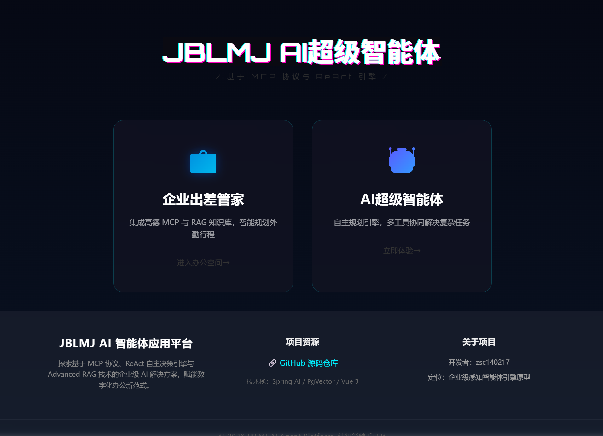
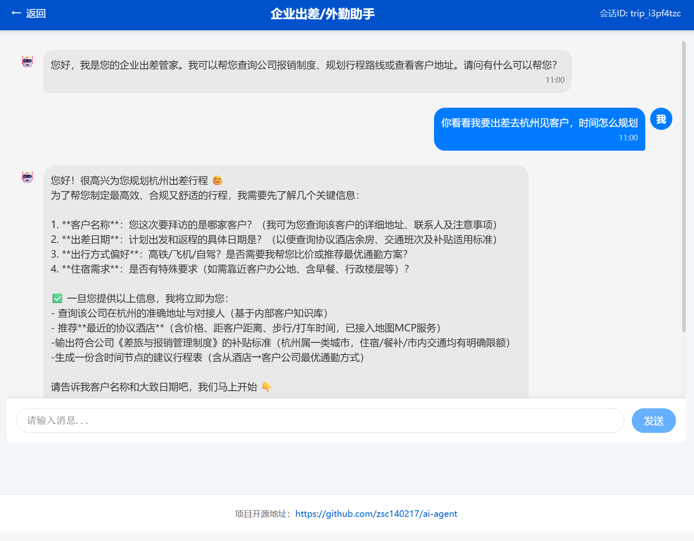
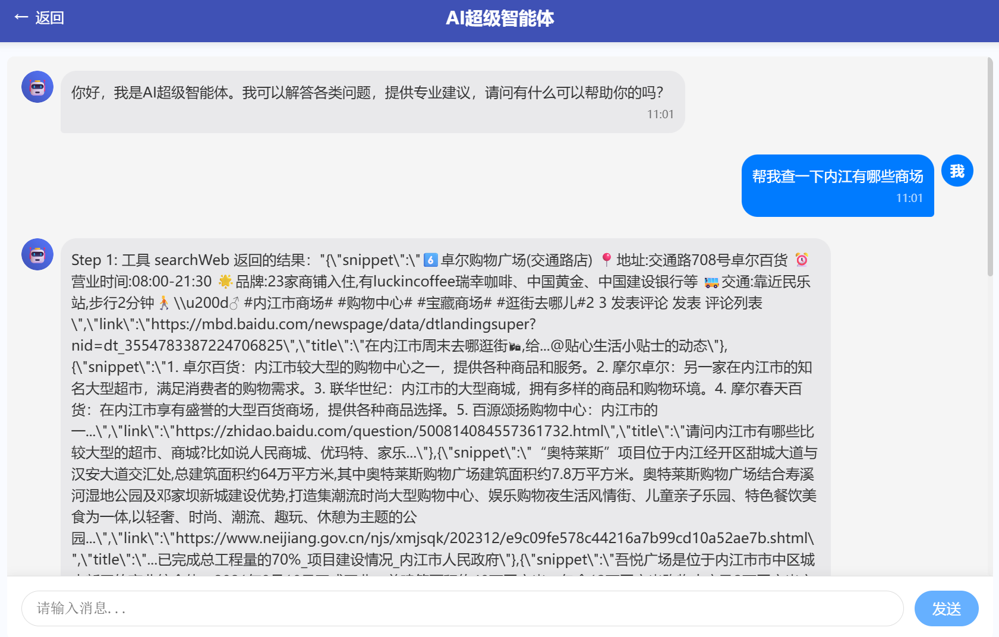

外勤感知智能体平台 (Outbound Perception Agent Platform)

📌 项目简介
本项目是一款针对企业外勤场景构建的 AI 原生智能体 (AI Agent)。它不仅是一个聊天机器人，而是一个具备“自主规划、实时感知、精准检索”能力的智能管家。通过整合企业内部规章（RAG 架构）与外部实时地理服务（MCP 协议），解决了员工出差报销咨询、行程自动规划、目的地感知等核心痛点。

🖼️ 项目演示 (Project Previews)
平台主界面	出差助手模块	智能体思考链路

系统全局工作台	差旅规章咨询与行程规划	Agent 自主拆解任务实时流

🛠️ 技术架构

后端核心栈

AI 框架: Spring AI (紧跟全链路大模型集成标准)
核心开发: Spring Boot 3.x, Java 17+
向量数据库: PostgreSQL + PgVector (支持语义检索)
高性能组件: Redis (缓存), Kryo (高效二进制序列化)
通信协议: SSE (Server-Sent Events) 流式响应, MCP (Model Context Protocol)
AI 增强技术
Agent 模式: 自研 ReAct 状态机架构
RAG 优化: Query Rewriting (查询重写) + Metadata Enrichment (元数据增强)
能力扩展: Tool Calling (高德地图、网页抓取、PDF 生成)

🚀 核心功能与技术亮点
1. 自研 ReAct 智能体引擎
挑战: 传统的 LLM 调用难以处理需要多步推理的复杂场景。
方案: 基于 Spring AI 构建了 ReAct (Reasoning and Acting) 状态机，实现了 Agent 的自主任务拆解。
效果: 支持最高 20 步 的闭环决策执行，能够处理如“根据规章判断报销标准 -> 查询高德地图计算距离 -> 生成差旅行程单”的一串连任务。
2. 高阶 RAG 检索优化 (准确率提升 30%)
挑战: 企业内部规章手册内容模糊，直接检索命中率低。
方案: 引入 Query Rewriting 将用户口语转化为结构化查询，并利用 Metadata Enrichment 对规章条款进行预标注。
效果: 经过评测，模糊意图下的知识检索准确率较原生 RAG 提升了约 30%。
3. MCP 协议与实时感知
挑战: 大模型对现实地理信息存在“幻觉”，无法实时获知当前路况或地点变更。
方案: 标准化接入 MCP (Model Context Protocol) 协议，对接高德地图第三方 API。
效果: Agent 可实时获取外勤目的地的地理位置、周边环境及天气，彻底解决幻觉问题。
4. 极致的性能优化
流式交互: 采用 SSE 技术 实时展示 Agent 的“思考链 (Thought Chain)”，将首字响应时间降至毫秒级。
存储优化: 自定义持久化组件，引入 Kryo 二进制序列化 存储 ChatMemory，大幅度降低了长上下文加载时的 IO 延迟。

👨‍💻 关于作者

张书铖
四川大学 | 计算机科学与技术
求职意向：后端开发工程师 / 大模型应用工程师
邮箱：zshucheng2004@gmail.com

